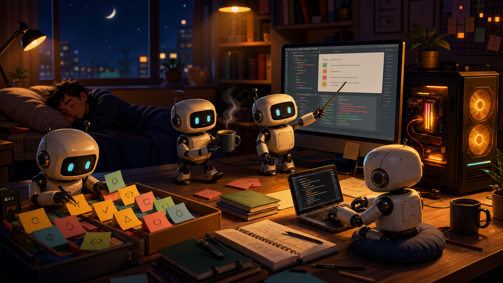

# Night Shift



[](LICENSE)
[](SAFETY.md)
[](#what-it-will-never-do)
[](#what-you-wake-up-to)

**Put your idle AI hardware to work while you sleep.**

Here's the problem Night Shift solves: you already own AI hardware — a
MacBook with unified memory, a gaming GPU, a spare desktop — and every night
it sits idle. Those are free tokens. The hardware is paid for; the
electricity costs cents. Night Shift collects them: overnight, your machines
read your repo, find small safe work, and draft. You wake up to a short
ranked brief with the few things worth looking at first.

It never pushes, merges, releases, or touches credentials. Drafts, not
deploys. Free and open source under the [MIT License](LICENSE).

## What You Wake Up To

```text
Morning brief — status: YELLOW

1. Missing tests around config fallback loading   → patch plan ready to review
2. Setup docs still reference an old command      → small docs fix drafted
3. One manual QA claim needs a human check        → flagged, not trusted

Local loops: 40 · Windows loops: 20 · Artifacts: KEEP=3 MAYBE=7 REJECT=50
Draft PRs opened: 0
Next action: verify item 1 and open one narrow draft PR if the gap is real.
```

Every item is a ranked, source-backed suggestion with proof paths — not merged
code. That `YELLOW` is intentional: the machines did useful work overnight,
and you (or your coding agent) still make the call in the morning.

## Quick Start

```bash
git clone https://github.com/r3dbars/nightshift.git
cd nightshift
./install.sh
night-shift start        # friendly guided setup, then the overnight run
```

Next morning:

```bash
night-shift report --latest
```

**Works with:** LM Studio, Ollama (auto-detected), or any OpenAI-compatible
local model server · a second GPU box on your LAN as a heavy draft lane ·
optionally the Claude CLI for one or two hard questions a night and the
GitHub CLI for open-PR context.

**No local models yet?** `night-shift start` still works: it makes a read-only
planning brief and tells you exactly what to set up.

## Make It Automatic

You shouldn't have to remember Night Shift exists. Arm it once and your
hardware clocks in every night by itself:

```bash
night-shift schedule --nightly 23:30   # runs every night with your saved setup
night-shift schedule --status          # when it runs, what happened, how to stop
night-shift snooze --days 7            # vacation switch
```

The standing shift looks after itself: it **pauses when three morning briefs
pile up unread** (no zombie automation making reports nobody reads — reading
one resumes it), drops to quiet mode on battery, and turns off with one
command. Optionally, `night-shift deliver --latest --github-issue` keeps a
single digest issue in your repo updated with each morning's brief — the only
thing Night Shift ever writes to a repo, and never code. The full design:
[docs/autopilot.md](docs/autopilot.md).

## How It Works

```text
+--------------+     +----------------------+     +---------------+
| Your repo    | --> | Night Shift          | --> | Morning brief |
| Your compute | --> | local / GPU / cloud  | --> | KEEP / MAYBE  |
+--------------+     +----------------------+     +---------------+
```

1. **Scan** the repo: recent files, TODOs, missing tests, docs drift, open PRs.
2. **Queue** a small, repo-specific list of safe work from those real signals.
3. **Work** it with bounded local and network worker loops, all night.
4. **Dedupe and rank**: repeated findings merge into fewer, stronger candidates.
5. **Brief** you in the morning with the 3-5 best next actions, with evidence.

You choose how much it may prepare:

| Autonomy | What you get |
| --- | --- |
| `brief` (default) | read-only repo scan, ranked work queue, morning brief |
| `draft-local` | + exact patch plans, issue candidates, and test ideas |
| `draft-prs` | + review-ready draft PR candidates — still no push, no merge |

And how hard it runs:

| Mode | Use it for | Rough shape |
| --- | --- | --- |
| `quiet` | battery, small repos, short evenings | ~8 worker loops, low heat |
| `night-shift` | the normal overnight run | ~60 loops, ~500k local tokens |
| `afterburner` | maximizing idle hardware | ~200 loops, 2M+ local tokens |

## What It Will Never Do

- Push commits or merge PRs from an overnight run.
- Release, deploy, publish, tag, or notarize.
- Touch credentials, billing, or repository visibility.
- Move or delete your files.
- Pretend an unverified draft is the truth.

Code changes are PR-only: after the run, you (or your coding agent) review one
item, make the change in an isolated worktree, run the checks, and open a
draft PR yourself. The full boundary lives in [SAFETY.md](SAFETY.md).

## Learn More

- **[Autopilot design](docs/autopilot.md)** — how the standing nightly run
  stays trustworthy: attention-aware pausing, battery awareness, snooze, and
  opt-in morning delivery.
- **[User guide](docs/guide.md)** — the setup wizard walkthrough, every file a
  run produces, advanced recipes, and full mode details.
- **[20 use cases](docs/use-cases.md)** — from "solo Mac with LM Studio" to
  "messy PR queue" to full tokenmaxx nights.
- **[Copy-paste examples](skills/night-shift/examples)** — including a fake
  [sample morning brief](skills/night-shift/examples/sample-morning-brief.md).
- **[Safety and privacy](SAFETY.md)** — what each worker lane can see and why
  the boundaries exist.
- **[Troubleshooting](docs/troubleshooting.md)** ·
  **[Contributing](CONTRIBUTING.md)** · **[Changelog](CHANGELOG.md)**

## Mascot


The Night Shift helper: tiny, caffeinated, and only allowed to make drafts
until a human checks the work.

---

MIT © r3dbars · [LICENSE](LICENSE)
