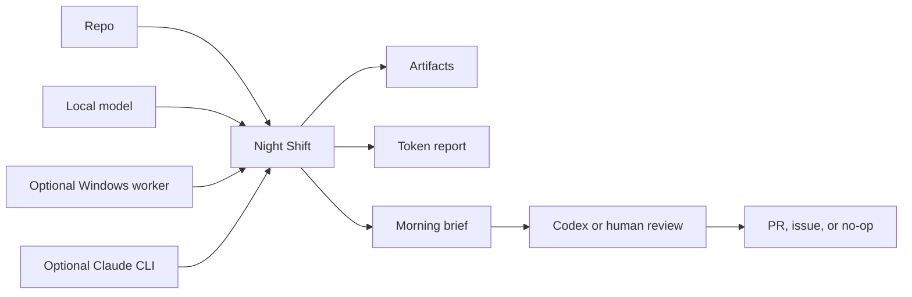

# Night Shift User Guide

The full walkthrough: why Night Shift exists, what the setup wizard asks, what
a run produces on disk, how to install and point it at your compute, and what
each mode really does. For the short version, start with the
[README](../README.md).

## Why This Exists

Most AI coding tools are optimized for the moment you are sitting there.
Night Shift is optimized for the hours when you are not.

It turns idle compute into bounded, reviewable repo work:

- repo scans that understand the current branch, recent files, TODOs, docs, and
  test commands
- deduped work queues so repeated worker ideas become one stronger candidate
- test-gap maps
- stale PR reviews
- TODO and risk clustering
- release-readiness notes
- issue drafts
- small patch plans
- morning briefs that say what is real, what is draft, and what still needs a human

The joke version: it lets your machines have a productive little night shift,
without letting them become management.

## The Setup Wizard

The simplest launch story:

1. Run `night-shift start`.
2. Answer a few plain-English setup questions.
3. Review the "will / will not" summary.
4. Let Night Shift run.
5. Run `night-shift report --latest` in the morning.

The promise is not "wake up to merged code." The promise is "wake up to a
ranked, source-backed brief, proof paths, token totals, and a clear first move."

The wizard starts like a tiny decision brief:

```text
Welcome to Night Shift.

First time here, so I will set up the basics with you.
We are choosing four things:
- the repo to read
- what would make tomorrow morning useful
- where your code is allowed to go
- how hard and how long Night Shift should work

Safe default: local, read-only, no pushes, no merges, no releases.
```

Then it asks beginner questions in this order:

1. Which project should Night Shift look at?
2. What would make tomorrow morning a win?
3. What should Night Shift aim at first?
4. Where is repo context allowed to go tonight?
5. What is Night Shift allowed to prepare?
6. How much energy should it use?
7. When should it stop?

Then it shows a summary before launching:

```text
Night Shift preview

Project: /path/to/project
Tonight it WILL:
- Read the repo
- Use: local Mac AI
- Aim for: Ranked repo chores and test ideas
- Run in Normal mode
- Read only and make a morning brief
- Autonomy: Read-only. Make a brief and a ranked queue.
- Stop after 6 hours
- Save a repo scan, deduped work queue, morning brief, and artifacts

Tonight it WILL NOT:
- Push commits
- Open PRs without a separate Codex or human review step
- Merge PRs
- Release, deploy, publish, tag, or notarize
- Delete or reorganize user files
- Change credentials, billing, or repo visibility
- Edit this checkout directly
```

The wizard also writes a setup lab under `~/.codex/maestro/overnight/`.
Look for `lab/readiness.json`, `lab/providers.json`, and `lab/routing.json`.

When an AI assistant drives setup from chat (using the bundled skill), the
first question is about local AI hardware: with consent it scans for Apple
Silicon unified memory, GPUs, LM Studio, and Ollama, and only afterward asks
about cloud subscriptions. See
[`skills/night-shift/SKILL.md`](../skills/night-shift/SKILL.md).

If something feels off, see [troubleshooting.md](troubleshooting.md).

## Autonomy Levels

Advanced users can skip the wizard and choose directly:

```bash
night-shift run --repo /path/to/project \
  --mode night-shift \
  --permission draft-prs
```

- `brief`: read-only repo scan, artifacts, and a ranked queue.
- `draft-local`: exact patch plans, issue candidates, files, and tests.
- `draft-prs`: review-ready draft PR candidates. The run still does not push,
  merge, release, or deploy.



## What A Run Writes To Disk

Everything lands under:

```text
~/.codex/maestro/overnight/night-shift-<timestamp>/
```

Useful files:

- `startup-gate.md`: what compute was reachable.
- `repo-scan.md` / `repo-scan.json`: branch, recent files, TODO sample, docs,
  test files, and detected test commands.
- `board.md`: the work queue.
- `planned-work-queue.json`: the repo-specific queue chosen before workers run.
- `context-pack.txt`: repo context used for prompts.
- `artifacts/`: local and Windows worker outputs.
- `processes.tsv`: process IDs for graceful stop.
- `harvest.md`: ranked worker outputs.
- `work-queue.md` / `work-queue.json`: deduped action choices after worker
  scoring.
- `token-report.txt`: estimated tokens by lane.
- `morning.md`: the morning brief.

## Setup

One-command install:

```bash
./install.sh
night-shift start
```

Install into a different Codex home:

```bash
./install.sh --codex-home /path/to/codex-home
```

Install for development from this checkout:

```bash
./install.sh --link
```

Linked mode points `~/.codex/bin/maestro-*` and
`~/.codex/skills/night-shift` at this Git checkout, so changes under
`bin/` or `skills/night-shift/` can be committed and pushed normally.

Advanced: install and immediately run doctor:

```bash
./install.sh --doctor /path/to/project
```

Required for install:

- macOS or Linux shell.
- `git`, `python3`, `curl`, and `rsync`.

Required for a real run:

- Git repo on this machine.
- `~/.codex/bin/maestro-delegate`
- `~/.codex/bin/maestro-token-report`

If you install somewhere else, set `CODEX_HOME` before running `./install.sh`.
Night Shift will use `$CODEX_HOME/bin`, `$CODEX_HOME/skills`, and
`$CODEX_HOME/maestro/overnight`.

Recommended:

- A local model server: LM Studio at `http://localhost:1234` or Ollama at
  `http://localhost:11434`. If LM Studio is not reachable, Night Shift
  auto-detects a running Ollama and picks your best downloaded coder or
  instruct model.
- A loaded chat model, for example `phi-4-mini-instruct` or `qwen2.5-coder`.
- Optional Windows worker endpoint on your LAN or private network.
- Claude CLI installed if you want the reasoning lane.
- GitHub CLI signed in if you want PR state included in the context pack.

If your shell cannot find `night-shift`, use either of these:

```bash
export PATH="$HOME/.codex/bin:$PATH"
~/.codex/bin/night-shift start
```

Advanced: point it at different compute:

```bash
night-shift doctor --repo /path/to/project \
  --local-url http://localhost:1234/v1 \
  --local-model phi-4-mini-instruct \
  --windows-url http://windows-host.local:11434/v1 \
  --windows-model qwen3-coder:30b
```

Use `--latest` or `--ledger <path>` when reporting or stopping:

```bash
night-shift report --latest
night-shift stop --latest
night-shift report --ledger ~/.codex/maestro/overnight/night-shift-...
```

If something is missing, the wizard and doctor output should tell you exactly
what to start. The `run` command writes ledgers and artifacts only; it reads
repo state but does not fetch, commit, branch, merge, publish, or edit the
target repo.

### Advanced Recipes

Mac-only:

```bash
open -a "LM Studio"
night-shift doctor --repo /path/to/project
night-shift run --repo /path/to/project --mode quiet --max-windows 0
```

Windows worker only:

```bash
export WINDOWS_WORKER_BASE_URL=http://WINDOWS_HOST:11434/v1
export WINDOWS_WORKER_MODEL=qwen3-coder:30b
night-shift doctor --repo /path/to/project --windows-url "$WINDOWS_WORKER_BASE_URL"
night-shift run --repo /path/to/project --mode quiet --max-local 0
```

Mac plus Windows:

```bash
open -a "LM Studio"
export WINDOWS_WORKER_BASE_URL=http://WINDOWS_HOST:11434/v1
export WINDOWS_WORKER_MODEL=qwen3-coder:30b
night-shift doctor --repo /path/to/project --windows-url "$WINDOWS_WORKER_BASE_URL"
night-shift run --repo /path/to/project --mode night-shift
```

No local model yet:

```bash
night-shift doctor --repo /path/to/project
night-shift plan --repo /path/to/project --mode quiet
```

Optional lanes:

- Claude: install and sign in to the `claude` CLI for rare hard reasoning tasks.
- GitHub: install `gh` and run `gh auth login` to include open PR context.
- Windows: use any OpenAI-compatible server and point `WINDOWS_WORKER_BASE_URL`
  at it. If you do not have one, leave it unset and run Mac-only with
  `--max-windows 0`.

## Who It Is For

- Solo developers with a Mac and a backlog of small repo chores.
- Teams with a spare local GPU box that can draft reviews, tests, and issue
  ideas overnight.
- Codex users who want a clean morning handoff instead of a giant pile of chat.
- Claude Code users who want the expensive reasoning lane saved for the few
  decisions that deserve it.
- Anyone who wants AI help without pretending green automation equals proof.

It is probably not for you if you want a bot to merge, deploy, or publish while
you are away.

## Mode Details

### Quiet

Use this for a laptop on battery, a small repo, or a short evening pass.

- Mac local loops: 6
- Windows loops: 2
- Parallel local: 1
- Parallel Windows: 1
- Token target: 50k estimated local/Windows tokens

### Night Shift

Use this as the normal overnight setting.

- Mac local loops: 40
- Windows loops: 20
- Parallel local: 3
- Parallel Windows: 2
- Token target: 500k estimated local/Windows tokens

### Afterburner

Use this when you want to maximize idle hardware.

- Mac local loops: 120
- Windows loops: 80
- Parallel local: 4
- Parallel Windows: 2
- Token target: 2M estimated local/Windows tokens

## What Good Overnight Work Looks Like

- Find missing tests.
- Map risky files.
- Cluster TODOs and bug smells.
- Review stale PRs.
- Create release-readiness briefs.
- Compare user stories to tests and analytics.
- Mine PostHog/Sentry gaps.
- Draft small patch plans.
- Prepare draft PR candidates for Codex or a human to review.
- Produce morning-ready issues.

Do not paste secrets, customer data, raw transcripts, audio, meeting titles,
speaker names, private URLs, raw file paths, billing details, or personal
contact details into prompts. Local lanes see prompts on this machine; Windows
lanes see prompts on the configured Windows worker. The full boundary is in
[SAFETY.md](../SAFETY.md).

## Morning Workflow

In the morning:

```bash
night-shift report --latest
```

Then review:

1. `morning.md`
2. `harvest.md`
3. `token-report.txt`
4. high-signal files in `artifacts/`

The first screen of `morning.md` is intentionally ranked. It should answer:

- What should I do first?
- What are the top 5 actionable items?
- How many local and Windows loops ran?
- How many estimated input/output/total tokens were spent by lane?
- Which artifacts were `KEEP`, `MAYBE`, or `REJECT`?
- What stayed draft-only or manual/unknown?

The right next action is usually one of these:

- Ask Codex to turn one `KEEP` artifact into a PR.
- Ask Codex to launch a focused review/merge thread.
- Rerun in `quiet` mode with a narrower target.
- Stop because the project is ready for manual QA or release.

Stop a run at any time:

```bash
night-shift stop --latest
```

## Naming

Product name: `Night Shift`. Command: `night-shift`. Repository: `nightshift`.

Friendly phrases that work well with the bundled skill:

- "Start Night Shift on this repo."
- "Run Afterburner tonight."
- "Morning brief."
- "Stop Night Shift."

Words this project avoids on purpose: "autonomous release bot", "hands-free
deploys", "self-merging agent", "production proof".
