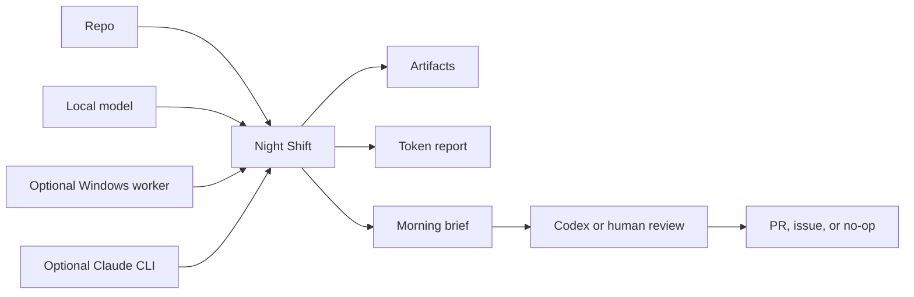

# Night Shift User Guide

The full walkthrough: why Night Shift exists, what the setup wizard asks, what
a run produces on disk, how to install and point it at your compute, and what
each mode really does. For the short version, start with the
[README](../README.md).

## Why This Exists

Most AI coding tools are optimized for the moment you are sitting there.
Night Shift is optimized for the hours when you are not.

It turns idle compute into bounded, reviewable work across recently active
GitHub repositories:

- repo scans that understand the current branch, recent files, TODOs, docs, and
  test commands
- durable task fingerprints so unchanged work is never repeated across cycles or nights
- test-gap maps
- stale PR reviews
- TODO and risk clustering
- release-readiness notes
- issue drafts
- small patch plans
- morning briefs that say what is real, what is draft, and what still needs a human

Night Shift keeps two outcome counts separate: a `candidate` is a model-ranked
`KEEP` or `MAYBE`; a `verified draft` is a bounded patch that passed its
approved checks. The durable `outcome-metrics.json` records both, plus
`tokens_per_verified_draft`, so a busy night cannot look productive just
because the model returned suggestions.

To check the long-term rebuild target mechanically, run
`python3 scripts/check-quality-scorecard.py`. It exits nonzero and lists every
dimension below 95 until the evidence is actually there.

When you vote on a morning item, Night Shift also saves whether that item was
only a candidate or had a verified draft behind it. That keeps later learning
honest about what was actually useful.

`night-shift health` also summarizes the full local outcome ledger, including
verified drafts, candidate-only work, tokens per verified draft, useful votes
by outcome type, and passing hosted drafts.

The joke version: it lets your machines have a productive little night shift,
without letting them become management.

## The Setup Wizard

The simplest launch story:

1. Run `night-shift start`.
2. Review the automatically detected safe plan.
3. Approve starting it.
4. Run `night-shift report --latest` in the morning.

The normal flow asks only whether to start. GitHub scope, available local AI,
configured LAN compute, local-first privacy, Normal mode, draft-local autonomy,
and an eight-hour stop are selected automatically. Run
`night-shift start --advanced` to customize those choices.

The promise is not "wake up to merged code." The promise is "keep idle local
AI doing new useful work until morning, then show a short brief with proof."

Feedback affects the next night before tokens are spent. A useful vote raises
similar grounded work for the same repo. One not-useful vote downranks it; two
not-useful votes suppress that task family in Normal mode. Afterburner can still
inspect suppressed families, and feedback can never make an ungrounded task
eligible.

The normal wizard starts like a tiny decision brief:

```text
Welcome to Night Shift.

This is your first time here, so I will check this project and the AI already
available on your machines.
Then I will show one safe plan. You only need to decide whether to start it.

Safe default: local, read-only, no pushes, no merges, no releases.
```

The normal path asks only whether to start. If you choose `--advanced`, the
extra questions are still plain English and have safe defaults:

1. Should it watch only this project or recently active GitHub repos?
2. Are there any `owner/repo` projects to prioritize?
3. When should scheduled Night Shift runs stay quiet?
4. What would make tomorrow morning a win?
5. What should Night Shift aim at first?
6. Where is repo context allowed to go tonight?
7. What is Night Shift allowed to prepare?
8. If drafts are allowed, may it try a disposable, test-gated patch?
9. If draft PRs are allowed, may it open a tested GitHub draft PR for review?
10. How much energy should it use?
11. When should it stop?

You do not need to know model names, server URLs, GitHub commands, or repo
internals to get started. Night Shift detects what it can and continues with a
planning brief when no AI worker is ready.

Then it shows a summary before launching:

```text
Night Shift preview

Project: /path/to/project
Tonight it WILL:
- Watch recently active GitHub repos
- Use: local Mac AI
- Aim for: Ranked repo chores and test ideas
- Run in Normal mode
- Read only and make a morning brief
- Autonomy: Read-only. Make a brief and a ranked queue.
- Stop after 6 hours
- Save a repo scan, deduped work queue, morning brief, and artifacts

Tonight it WILL NOT:
- Push commits
- Open PRs without a separate Codex or human review step
- Merge PRs
- Release, deploy, publish, tag, or notarize
- Delete or reorganize user files
- Change credentials, billing, or repo visibility
- Edit this checkout directly
```

The wizard also writes a setup lab under `~/.codex/maestro/overnight/`.
Look for `lab/readiness.json`, `lab/providers.json`, and `lab/routing.json`.

When an AI assistant drives setup from chat (using the bundled skill), the
first question is about local AI hardware: with consent it scans for Apple
Silicon unified memory, GPUs, LM Studio, and Ollama, and only afterward asks
about cloud subscriptions. See
[`skills/night-shift/SKILL.md`](../skills/night-shift/SKILL.md).

If something feels off, see [troubleshooting.md](troubleshooting.md).

## Autonomy Levels

Advanced users can skip the wizard and choose directly:

```bash
night-shift autopilot --repo /path/to/project \
  --scope github-recent \
  --privacy mac-only \
  --active-days 14 \
  --max-repos 3 \
  --mode night-shift \
  --permission draft-prs \
  --execute-drafts \
  --stop-after 8h
```

- `brief`: read-only repo scan, artifacts, and a ranked queue.
- `draft-local`: exact patch plans, issue candidates, files, tests, and isolated tested drafts when enabled; nothing is pushed.
- `draft-prs`: review-ready candidates, plus optional isolated patches when
  `--execute-drafts` is enabled. With one-time explicit authorization, a patch
  that passes the approved sandbox check again may become a GitHub draft PR.
  Night Shift never merges, releases, or deploys.

Autopilot works down the same usefulness ladder in every repository:

```text
Repair -> Finish -> Strengthen -> Understand -> Index
```

It stays available until the stop time. It runs new task batches immediately,
then polls GitHub after the unique backlog is exhausted. Task fingerprints are
stored in `~/.codex/night-shift/task-history.jsonl`; a task becomes eligible
again only when its repository revision or live signal changes.

GitHub portfolio mode keeps dedicated clean checkouts under
`~/.codex/night-shift/repos/`. It never edits an existing user checkout. A
configuration created before portfolio mode remains `current` scope until the
user explicitly reruns setup and chooses recently active GitHub repos.



## What A Run Writes To Disk

Everything lands under:

```text
~/.codex/maestro/overnight/night-shift-<timestamp>/
```

Useful files:

- `startup-gate.md`: what compute was reachable.
- `repo-scan.md` / `repo-scan.json`: branch, recent files, TODO sample, docs,
  test files, and detected test commands.
- `board.md`: the work queue.
- `planned-work-queue.json`: the repo-specific queue chosen before workers run.
- `context-pack.txt`: repo context used for prompts.
- `artifacts/`: local and Windows worker outputs.
- `processes.tsv`: process IDs for graceful stop.
- `harvest.md`: ranked worker outputs.
- `work-queue.md` / `work-queue.json`: deduped action choices after worker
  scoring.
- `token-report.txt`: estimated tokens by lane.
- `morning.md`: the morning brief.

When you prepare a morning handoff, Night Shift also saves an inspectable,
redacted pack under `handoff/`, plus a JSON manifest with the exact file list,
SHA-256 hashes, byte counts, redaction count, privacy result, and whether
anything was sent. A preview never sends the pack; an approved review uses a
fresh temporary copy and leaves the saved pack unchanged.

Portfolio autopilot also writes a parent `*-autopilot/` ledger containing:

- `portfolio.json` / `portfolio.md`: ranked repositories and live GitHub signals.
- `cycles.json`: every repository batch and its child ledger.
- `drafts/`: isolated patches, Aider transcripts, and deterministic proof JSON.
- `morning.md`: one portfolio-level closeout.

## Setup

One-command install:

```bash
./install.sh
```

The installer adds Night Shift to your shell `PATH` once. Open a new terminal
and run `night-shift start`. To leave your shell profile unchanged, use
`./install.sh --no-path` and run the absolute command printed by the installer.

Maintainers can repeat the clean Ubuntu installation proof with:

```bash
scripts/prove-linux-install.sh
```

Install into a different Codex home:

```bash
./install.sh --codex-home /path/to/codex-home
```

Install for development from this checkout:

```bash
./install.sh --link
```

Linked mode points `~/.codex/bin/maestro-*` and
`~/.codex/skills/night-shift` at this Git checkout, so changes under
`bin/` or `skills/night-shift/` can be committed and pushed normally.

Advanced: install and immediately run doctor:

```bash
./install.sh --doctor /path/to/project
```

Required for install:

- macOS or Linux shell.
- `git`, `python3`, `curl`, and `rsync`.

Required for a real run:

- Git repo on this machine.
- `~/.codex/bin/maestro-delegate`
- `~/.codex/bin/maestro-token-report`

If you install somewhere else, set `CODEX_HOME` before running `./install.sh`.
Night Shift will use `$CODEX_HOME/bin`, `$CODEX_HOME/skills`, and
`$CODEX_HOME/maestro/overnight`.

Recommended:

- A local model server: LM Studio at `http://localhost:1234` or Ollama at
  `http://localhost:11434`. If LM Studio is not reachable, Night Shift
  auto-detects a running Ollama and picks your best downloaded coder or
  instruct model.
- A loaded chat model, for example `phi-4-mini-instruct` or `qwen2.5-coder`.
- Optional Windows worker endpoint on your LAN or private network.
- Claude CLI installed if you want the reasoning lane.
- GitHub CLI signed in if you want PR state included in the context pack.

If the current terminal has not picked up the new PATH yet, use either of these:

```bash
export PATH="$HOME/.codex/bin:$PATH"
~/.codex/bin/night-shift start
```

Advanced: point it at different compute:

```bash
night-shift doctor --repo /path/to/project \
  --local-url http://localhost:1234/v1 \
  --local-model phi-4-mini-instruct \
  --windows-url http://windows-host.local:11434/v1 \
  --windows-model qwen3-coder:30b
```

Use `--latest` or `--ledger <path>` when reporting or stopping:

```bash
night-shift report --latest
night-shift stop --latest
night-shift report --ledger ~/.codex/maestro/overnight/night-shift-...
```

If something is missing, the wizard and doctor output should tell you exactly
what to start. The `run` command writes ledgers and artifacts only; it reads
repo state but does not fetch, commit, branch, merge, publish, or edit the
target repo.

### Advanced Recipes

Mac-only:

```bash
open -a "LM Studio"
night-shift doctor --repo /path/to/project
night-shift run --repo /path/to/project --mode quiet --max-windows 0
```

Windows worker only:

```bash
export WINDOWS_WORKER_BASE_URL=http://WINDOWS_HOST:11434/v1
export WINDOWS_WORKER_MODEL=qwen3-coder:30b
night-shift doctor --repo /path/to/project --windows-url "$WINDOWS_WORKER_BASE_URL"
night-shift run --repo /path/to/project --mode quiet --max-local 0
```

Mac plus Windows:

```bash
open -a "LM Studio"
export WINDOWS_WORKER_BASE_URL=http://WINDOWS_HOST:11434/v1
export WINDOWS_WORKER_MODEL=qwen3-coder:30b
night-shift doctor --repo /path/to/project --windows-url "$WINDOWS_WORKER_BASE_URL"
night-shift run --repo /path/to/project --mode night-shift
```

No local model yet:

```bash
night-shift doctor --repo /path/to/project
night-shift plan --repo /path/to/project --mode quiet
```

Optional lanes:

- Claude: install and sign in to the `claude` CLI for rare hard reasoning tasks.
- GitHub: install `gh` and run `gh auth login` to include open PR context.
- Windows: use any OpenAI-compatible server and point `WINDOWS_WORKER_BASE_URL`
  at it. If you do not have one, leave it unset and run Mac-only with
  `--max-windows 0`.

## Who It Is For

- Solo developers with a Mac and a backlog of small repo chores.
- Teams with a spare local GPU box that can draft reviews, tests, and issue
  ideas overnight.
- Codex users who want a clean morning handoff instead of a giant pile of chat.
- Claude Code users who want the expensive reasoning lane saved for the few
  decisions that deserve it.
- Anyone who wants AI help without pretending green automation equals proof.

It is probably not for you if you want a bot to merge, deploy, or publish while
you are away.

## Mode Details

### Quiet

Use this for a laptop on battery, a small repo, or a short evening pass.

- Mac local loops: 6
- Windows loops: 2
- Parallel local: 1
- Parallel Windows: 1
- Token target: 50k estimated local/Windows tokens

### Night Shift

Use this as the normal overnight setting.

- Mac local loops: 40
- Windows loops: 20
- Parallel local: 3
- Parallel Windows: 2
- Token target: 500k estimated local/Windows tokens

### Afterburner

Use this when you want to maximize idle hardware.

- Mac local loops: 120
- Windows loops: 80
- Parallel local: 4
- Parallel Windows: 2
- Token target: 2M estimated local/Windows tokens

## What Good Overnight Work Looks Like

- Find missing tests.
- Map risky files.
- Cluster TODOs and bug smells.
- Review stale PRs.
- Create release-readiness briefs.
- Compare user stories to tests and analytics.
- Mine PostHog/Sentry gaps.
- Draft small patch plans.
- Prepare draft PR candidates for Codex or a human to review.
- Produce morning-ready issues.

Do not paste secrets, customer data, raw transcripts, audio, meeting titles,
speaker names, private URLs, raw file paths, billing details, or personal
contact details into prompts. Local lanes see prompts on this machine; Windows
lanes see prompts on the configured Windows worker. The full boundary is in
[SAFETY.md](../SAFETY.md).

## Morning Workflow

In the morning:

```bash
night-shift report --latest
```

Then review:

1. `morning.md`
2. `harvest.md`
3. `token-report.txt`
4. high-signal files in `artifacts/`

The first screen of `morning.md` is intentionally ranked. It should answer:

- What should I do first?
- What are the top three evidence-backed choices?
- How many local and Windows loops ran?
- How many estimated input/output/total tokens were spent by lane?
- Which artifacts were `KEEP`, `MAYBE`, or `REJECT`?
- What stayed draft-only or manual/unknown?

Teach Night Shift after reviewing a choice:

```bash
night-shift feedback --latest --item 1 --useful
night-shift feedback --latest --item 2 --not-useful --note "too generic"
# Optional: also record clarity and review effort.
night-shift feedback --latest --item 1 --useful --clarity clear --effort quick
# Optional: record what happened after review.
night-shift feedback --latest --item 1 --useful --outcome accepted
night-shift feedback --latest --item 1 --useful --outcome revised
night-shift feedback --latest --item 1 --not-useful --outcome rejected --note "not worth carrying forward"
```

Feedback stays local and affects later prompts and rankings for that repo. The
optional clarity and effort fields help measure whether the morning brief is
easy to understand and quick to review. The optional outcome records whether a
verified draft was accepted, changed, or discarded, so Night Shift can measure
real value rather than treating every useful vote as a finished result.

The right next action is usually one of these:

- Ask Codex to turn one `KEEP` artifact into a PR.
- Ask Codex to launch a focused review/merge thread.
- Rerun in `quiet` mode with a narrower target.
- Stop because the project is ready for manual QA or release.

Stop a run at any time:

```bash
night-shift stop --latest
```

## Run It Every Night

Arm the standing shift once and stop thinking about it:

```bash
night-shift schedule --nightly 23:30
```

This installs a launchd agent (macOS) or cron entry (Linux) that runs
`night-shift nightly` at your chosen time. `nightly` reads your saved setup at
fire time — change your config and the next night picks it up automatically.

Unattended nights protect themselves, in this order:

1. **Snoozed?** `night-shift snooze --days 7` (or `--until 2026-07-14`) skips
   nights until the date passes; `snooze --off` resumes early.
2. **Being ignored?** If 3 overnight briefs are sitting unread, the run pauses
   itself and says so. Reading a brief (`night-shift report`) marks it
   reviewed and re-arms the next night.
3. **On battery?** The run drops to `quiet` mode automatically.

Inspect or stop it any time:

```bash
night-shift schedule --status   # armed? last run? unreviewed briefs? snooze?
night-shift schedule --off      # remove the standing shift
```

Optional morning delivery — post the brief where you already look:

```bash
night-shift deliver --latest --github-issue
```

This keeps exactly one open issue titled "🌙 Night Shift morning brief" per
repo, updated in place each morning via the `gh` CLI. It is the only thing
Night Shift ever writes to a repo — never code, never a second issue. Set
`"deliver": "github-issue"` in `~/.codex/night-shift/config.json` preferences
to have `nightly` do it automatically after each run. The rationale for all
of this lives in [autopilot.md](autopilot.md).

## Naming

Product name: `Night Shift`. Command: `night-shift`. Repository: `nightshift`.

Friendly phrases that work well with the bundled skill:

- "Start Night Shift on this repo."
- "Run Afterburner tonight."
- "Morning brief."
- "Stop Night Shift."

Words this project avoids on purpose: "autonomous release bot", "hands-free
deploys", "self-merging agent", "production proof".
