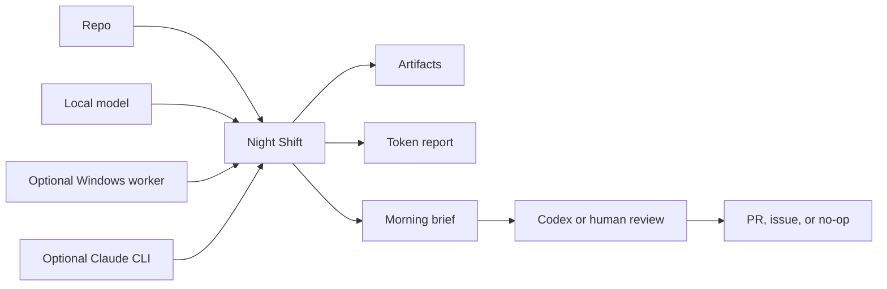

# Maestro Night Shift

[](#safety-and-privacy)
[](#what-it-will-do)
[](#morning-workflow)

Put your idle AI compute to work while you sleep.

Maestro Night Shift is a local-first overnight workbench for AI coding agents.
Point it at a repo, point it at the compute you already have, pick a mode, and
wake up to a morning brief with artifacts, safe draft ideas, token totals, and
the next action.

It does the useful night work: read, sort, map, draft, and report. It does not
merge, release, deploy, or pretend a worker draft is proof.

It is for developers who keep thinking, "I have a laptop, maybe a desktop GPU,
maybe Claude, and definitely a pile of repo chores. Why are all of them asleep
at the same time?"

It is not an autonomous release bot. Local and Windows models can think, sort,
review, and draft. The `run` command does not edit the target repo. Codex or a
human still reviews, edits, tests, and opens any PRs. Merges, releases, and
public launches require explicit manual approval after review.

For the safety and privacy boundary, including what worker lanes can see and
what gets written to disk, read [SAFETY.md](SAFETY.md).

Suggested GitHub description:

> Local-first overnight AI workbench: spend idle Mac/Windows compute on repo
> scans, draft plans, token reports, and a ranked morning brief.

## Why This Exists

Most AI coding tools are optimized for the moment you are sitting there. Maestro
Night Shift is optimized for the hours when you are not.

It turns idle compute into bounded, reviewable repo work:

- test-gap maps
- stale PR reviews
- TODO and risk clustering
- release-readiness notes
- issue drafts
- small patch plans
- morning briefs that say what is real, what is draft, and what still needs a human

The joke version: it lets your machines have a productive little night shift,
without letting them become management.

## Launch Story

The simplest version:

1. Run `doctor` to see which compute lanes are ready.
2. Run `plan` to make the work queue boring and bounded.
3. Run `run` when you are done steering for the night.
4. Run `report --latest` in the morning.

The promise is not "wake up to merged code." The promise is "wake up to a
ranked, source-backed brief, proof paths, token totals, and a clear first move."

## Quick Start

```bash
git clone https://github.com/r3dbars/maestro-night-shift.git
cd maestro-night-shift
./install.sh
maestro-nightshift --version
maestro-nightshift doctor --repo /path/to/project
maestro-nightshift plan --repo /path/to/project --mode night-shift
maestro-nightshift run --repo /path/to/project --mode night-shift
maestro-nightshift report --latest
```

If `maestro-nightshift` is not on your `PATH`, run it directly:

```bash
~/.codex/bin/maestro-nightshift doctor --repo /path/to/project
```

Need copy-paste recipes? See
[`skills/maestro-overnight/examples`](skills/maestro-overnight/examples).

Need shareable launch copy, repo-description options, and visual ideas? See
[MARKETING.md](MARKETING.md).

Stop a run:

```bash
maestro-nightshift stop --latest
```

## The Mental Model

There are two things to point at:

1. Compute: Mac local model, Windows GPU worker, Claude CLI, Codex.
2. Project: the repo you want improved.

Then choose one mode:

- `quiet`: low heat, low noise, small useful scans.
- `night-shift`: normal overnight run.
- `afterburner`: tokenmaxx mode. Use the hardware hard until morning.



Visual placeholder for a future README hero:

```text
+--------------+     +----------------------+     +---------------+
| Your repo    | --> | Maestro Night Shift  | --> | Morning brief |
| Your compute | --> | local / Windows / AI | --> | KEEP / MAYBE  |
+--------------+     +----------------------+     +---------------+
```

The run writes everything under:

```text
~/.codex/maestro/overnight/night-shift-<timestamp>/
```

Useful files:

- `startup-gate.md`: what compute was reachable.
- `board.md`: the work queue.
- `context-pack.txt`: repo context used for prompts.
- `artifacts/`: local and Windows worker outputs.
- `processes.tsv`: process IDs for graceful stop.
- `harvest.md`: ranked worker outputs.
- `token-report.txt`: estimated tokens by lane.
- `morning.md`: the morning brief.

## Setup

One-command install:

```bash
./install.sh
```

Install and immediately run doctor:

```bash
./install.sh --doctor /path/to/project
```

Required for install:

- macOS or Linux shell.
- `git`, `python3`, `curl`, and `rsync`.

Required for a real run:

- Git repo on this machine.
- `~/.codex/bin/maestro-delegate`
- `~/.codex/bin/maestro-token-report`

If you install somewhere else, set `CODEX_HOME` before running `./install.sh`.
Night Shift will use `$CODEX_HOME/bin`, `$CODEX_HOME/skills`, and
`$CODEX_HOME/maestro/overnight`.

Recommended:

- LM Studio running at `http://localhost:1234`.
- A loaded chat model, usually `phi-4-mini-instruct`.
- Optional Windows worker endpoint on your LAN or private network.
- Claude CLI installed if you want the reasoning lane.
- GitHub CLI signed in if you want PR state included in the context pack.

Check it:

```bash
maestro-nightshift doctor --repo /path/to/project
```

If your shell cannot find `maestro-nightshift`, use either of these:

```bash
export PATH="$HOME/.codex/bin:$PATH"
~/.codex/bin/maestro-nightshift doctor --repo /path/to/project
```

Point it at different compute:

```bash
maestro-nightshift doctor --repo /path/to/project \
  --local-url http://localhost:1234/v1 \
  --local-model phi-4-mini-instruct \
  --windows-url http://windows-host.local:11434/v1 \
  --windows-model qwen3-coder:30b
```

Use `--latest` or `--ledger <path>` when reporting or stopping:

```bash
maestro-nightshift report --latest
maestro-nightshift stop --latest
maestro-nightshift report --ledger ~/.codex/maestro/overnight/night-shift-...
```

If something is missing, the doctor output should tell you exactly what to start.
The `run` command writes ledgers and artifacts only; it reads repo state but does
not fetch, commit, branch, merge, publish, or edit the target repo.

### What To Start

Mac-only:

```bash
open -a "LM Studio"
maestro-nightshift doctor --repo /path/to/project
maestro-nightshift run --repo /path/to/project --mode quiet --max-windows 0
```

Windows worker only:

```bash
export WINDOWS_WORKER_BASE_URL=http://WINDOWS_HOST:11434/v1
export WINDOWS_WORKER_MODEL=qwen3-coder:30b
maestro-nightshift doctor --repo /path/to/project --windows-url "$WINDOWS_WORKER_BASE_URL"
maestro-nightshift run --repo /path/to/project --mode quiet --max-local 0
```

Mac plus Windows:

```bash
open -a "LM Studio"
export WINDOWS_WORKER_BASE_URL=http://WINDOWS_HOST:11434/v1
export WINDOWS_WORKER_MODEL=qwen3-coder:30b
maestro-nightshift doctor --repo /path/to/project --windows-url "$WINDOWS_WORKER_BASE_URL"
maestro-nightshift run --repo /path/to/project --mode night-shift
```

No local model yet:

```bash
maestro-nightshift doctor --repo /path/to/project
maestro-nightshift plan --repo /path/to/project --mode quiet
```

Optional lanes:

- Claude: install and sign in to the `claude` CLI for rare hard reasoning tasks.
- GitHub: install `gh` and run `gh auth login` to include open PR context.
- Windows: use any OpenAI-compatible server and point `WINDOWS_WORKER_BASE_URL` at it. If you do not have one, leave it unset and run Mac-only with `--max-windows 0`.

## Who It Is For

- Solo developers with a Mac and a backlog of small repo chores.
- Teams with a spare local GPU box that can draft reviews, tests, and issue
  ideas overnight.
- Codex users who want a clean morning handoff instead of a giant pile of chat.
- Claude Code users who want the expensive reasoning lane saved for the few
  decisions that deserve it.
- Anyone who wants AI help without pretending green automation equals proof.

It is probably not for you if you want a bot to merge, deploy, or publish while
you are away.

## Example Morning

After a useful run, the morning brief should sound boring in the best way:

```text
Status: YELLOW
Local loops: 40
Windows loops: 20
Artifacts: KEEP=3, MAYBE=7, REJECT=50
Draft PRs opened: 0
Manual proof: UNKNOWN
Next action: verify KEEP item 1 and open one narrow draft PR if the gap is real.
```

That `YELLOW` is intentional. It means the machines did useful work, but Codex
or a human still needs to verify the best item before it becomes a real change.

## Modes

### Quiet

Use this for a laptop on battery, a small repo, or a short evening pass.

Defaults:

- Mac local loops: 6
- Windows loops: 2
- Parallel local: 1
- Parallel Windows: 1
- Token target: 50k estimated local/Windows tokens

### Night Shift

Use this as the normal overnight setting.

Defaults:

- Mac local loops: 40
- Windows loops: 20
- Parallel local: 3
- Parallel Windows: 2
- Token target: 500k estimated local/Windows tokens

### Afterburner

Use this when you want to maximize idle hardware.

Defaults:

- Mac local loops: 120
- Windows loops: 80
- Parallel local: 4
- Parallel Windows: 2
- Token target: 2M estimated local/Windows tokens

## What It Will Do

Good overnight work:

- Find missing tests.
- Map risky files.
- Cluster TODOs and bug smells.
- Review stale PRs.
- Create release-readiness briefs.
- Compare user stories to tests and analytics.
- Mine PostHog/Sentry gaps.
- Draft small patch plans.
- Produce morning-ready issues.

What it will not do by itself:

- Merge PRs.
- Push commits or branches from the `run` command.
- Cut releases.
- Publish, tag, notarize, deploy, update appcasts, or update casks.
- Touch credentials or billing.
- Move or delete user files.
- Claim hardware, audio, Bluetooth, camera, or manual QA proof.

Code changes are PR-only: Night Shift artifacts can become a branch only after
Codex or a human chooses one reviewed item, makes the change in an isolated
worktree, runs checks, and opens a draft PR. Nothing from an overnight run is
merged or shipped without a separate approval.

Do not paste secrets, customer data, raw transcripts, audio, meeting titles,
speaker names, private URLs, raw file paths, billing details, or personal
contact details into prompts. Local lanes see prompts on this machine; Windows
lanes see prompts on the configured Windows worker.

## Public Launch Blocker

Do not make this repository public just because the current docs look clean.
Old closed PRs, branch refs, review comments, fork refs, and cached GitHub
objects can expose old history even after the visible branch is cleaned up.

Safest public path:

1. Create a fresh clean public repository from an audited export.
2. Or complete a GitHub-supported purge of old refs, PR refs, cached objects,
   and forks before changing visibility.

Until one of those is done, treat this repo as private-only.

## Twenty Common Scenarios

1. **Mac-only solo dev**
   - Compute: LM Studio only.
   - Mode: `quiet` or `night-shift`.
   - Best work: TODO mining, test gaps, docs drift, small patch plans.

2. **Mac plus Windows GPU worker**
   - Compute: LM Studio + Windows worker.
   - Mode: `night-shift` or `afterburner`.
   - Best work: Mac local does triage, Windows drafts deeper review and patch plans.

3. **Windows-only worker available**
   - Compute: Windows endpoint only.
   - Mode: `quiet`.
   - Best work: draft implementation plans, review notes, test ideas.

4. **Codex plan user**
   - Compute: Codex for execution and verification.
   - Mode: `night-shift`.
   - Best work: local/Windows generate artifacts, Codex turns the best few into PRs later.

5. **Claude Code plan user**
   - Compute: Claude CLI for hard reasoning.
   - Mode: `night-shift`.
   - Best work: one or two architecture or risk calls, not every small task.

6. **Codex plus Claude user**
   - Compute: Codex as cockpit, Claude as second-opinion lane.
   - Mode: `night-shift`.
   - Best work: risky refactor reviews, release risk review, hard bug hypotheses.

7. **No local models installed yet**
   - Compute: none local.
   - Mode: `doctor`.
   - Best work: setup checklist and project plan. Do not call it a real run yet.

8. **Private repo with sensitive data**
   - Compute: local only.
   - Mode: `quiet`.
   - Best work: keep prompts coarse and avoid private text, secrets, paths, or content.

9. **Open-source repo**
   - Compute: any lane.
   - Mode: `night-shift`.
   - Best work: issue triage, docs, tests, stale PR analysis.

10. **Messy PR queue**
    - Compute: local + Windows.
    - Mode: `night-shift`.
    - Best work: classify PRs as merge, close, superseded, cherry-pick, or hold.

11. **Release prep**
    - Compute: Codex verifies, local/Windows summarize.
    - Mode: `quiet`.
    - Best work: release-readiness brief, not publishing.

12. **Test coverage push**
    - Compute: local for gaps, Windows for draft tests.
    - Mode: `night-shift`.
    - Best work: find missing tests and propose exact fixtures.

13. **PostHog analytics audit**
    - Compute: local for taxonomy scan, Windows for dashboard questions.
    - Mode: `night-shift`.
    - Best work: events missing, properties missing, dashboards to add.

14. **Sentry reliability audit**
    - Compute: local for issue clustering.
    - Mode: `quiet`.
    - Best work: issue families, suspected files, repro ideas.

15. **Docs maintenance**
    - Compute: local.
    - Mode: `quiet`.
    - Best work: stale docs, missing setup steps, release doc drift.

16. **Refactor exploration**
    - Compute: local + Claude for hard calls.
    - Mode: `night-shift`.
    - Best work: rank candidates. Do not rewrite overnight.

17. **Issue triage backlog**
    - Compute: local + Windows.
    - Mode: `night-shift`.
    - Best work: classify, dedupe, and draft clean issue text.

18. **Multi-repo operator mode**
    - Compute: local + Windows.
    - Mode: one repo per run.
    - Best work: separate ledgers so morning review stays sane.

19. **Low-heat laptop overnight**
    - Compute: Mac local only, one worker.
    - Mode: `quiet`.
    - Best work: read-only scans and a short morning brief.

20. **Full tokenmaxx**
    - Compute: Mac local + Windows worker.
    - Mode: `afterburner`.
    - Best work: huge artifact generation, maps, audits, rankings, and morning triage.

## Morning Workflow

In the morning:

```bash
maestro-nightshift report --latest
```

Then review:

1. `morning.md`
2. `harvest.md`
3. `token-report.txt`
4. high-signal files in `artifacts/`

The first screen of `morning.md` is intentionally ranked. It should answer:

- What should I do first?
- What are the top 5 actionable items?
- How many local and Windows loops ran?
- How many estimated input/output/total tokens were spent by lane?
- Which artifacts were `KEEP`, `MAYBE`, or `REJECT`?
- What stayed draft-only or manual/unknown?

The right next action is usually one of these:

- Ask Codex to turn one `KEEP` artifact into a PR.
- Ask Codex to launch a focused review/merge thread.
- Rerun in `quiet` mode with a narrower target.
- Stop because the project is ready for manual QA or release.

## Naming And Package

Product name: `Maestro Night Shift`

Short name: `Night Shift`

Short command: `maestro-nightshift`

Repository/package name: `maestro-night-shift`

Friendly phrases:

- "Start Night Shift on this repo."
- "Run Afterburner tonight."
- "Morning brief."
- "Stop Night Shift."

Avoid:

- "Autonomous release bot"
- "Hands-free deploys"
- "Self-merging agent"
- "Production proof"

## Project Notes

License is currently pending; see `LICENSE`.

Contribution notes live in `CONTRIBUTING.md`.
