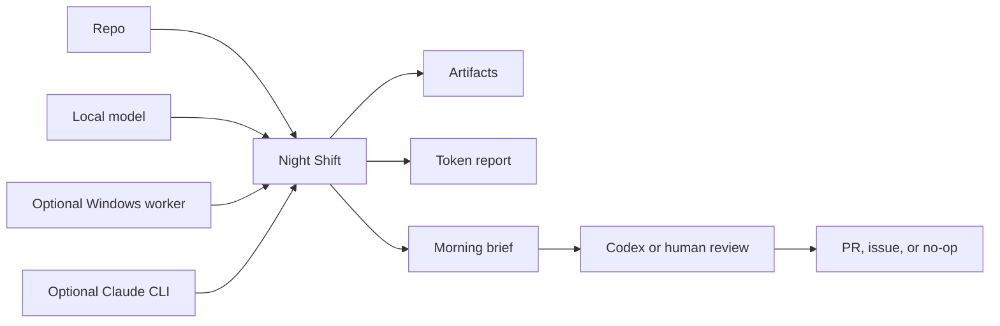

# Night Shift

[](#safety-and-privacy)
[](#what-it-will-do)
[](#morning-workflow)

Put your idle AI compute to work while you sleep.

Night Shift is a local-first overnight workbench for AI coding agents.
Point it at a repo, point it at the compute you already have, pick a mode, and
wake up to a morning brief with artifacts, safe draft ideas, token totals, and
the next action.

It does the useful night work: read, sort, map, draft, and report. It does not
merge, release, deploy, or pretend a worker draft is proof.

It is for developers who keep thinking, "I have a laptop, maybe a desktop GPU,
maybe Claude, and definitely a pile of repo chores. Why are all of them asleep
at the same time?"

It is not an autonomous release bot. Local and Windows models can think, sort,
review, and draft. The `run` command does not edit the target repo. Codex or a
human still reviews, edits, tests, and opens any PRs. Merges, releases, and
public launches require explicit manual approval after review.

For the safety and privacy boundary, including what worker lanes can see and
what gets written to disk, read [SAFETY.md](SAFETY.md).

Suggested GitHub description:

> Local-first overnight AI workbench: spend idle Mac/Windows compute on repo
> scans, draft plans, token reports, and a ranked morning brief.

## Why This Exists

Most AI coding tools are optimized for the moment you are sitting there.
Night Shift is optimized for the hours when you are not.

It turns idle compute into bounded, reviewable repo work:

- test-gap maps
- stale PR reviews
- TODO and risk clustering
- release-readiness notes
- issue drafts
- small patch plans
- morning briefs that say what is real, what is draft, and what still needs a human

The joke version: it lets your machines have a productive little night shift,
without letting them become management.

## Launch Story

The simplest version:

1. Run `night-shift start`.
2. Answer a few plain-English setup questions.
3. Review the "will / will not" summary.
4. Let Night Shift run.
5. Run `night-shift report --latest` in the morning.

The promise is not "wake up to merged code." The promise is "wake up to a
ranked, source-backed brief, proof paths, token totals, and a clear first move."

## Quick Start

```bash
git clone https://github.com/r3dbars/night-shift.git
cd night-shift
./install.sh
night-shift start
night-shift report --latest
```

If `night-shift` is not on your `PATH`, run it directly:

```bash
~/.codex/bin/night-shift start
```

`night-shift start` is the setup wizard. It checks what AI tools are available,
asks what the user wants to allow, saves the answers, shows a clear preview, and
then starts a safe run.

Need copy-paste recipes? See
[`skills/night-shift/examples`](skills/night-shift/examples).

Need shareable launch copy, repo-description options, and visual ideas? See
[MARKETING.md](MARKETING.md).

Stop a run:

```bash
night-shift stop --latest
```

## The Mental Model

The wizard asks four beginner questions:

1. Which project should Night Shift look at?
2. What AI tools should it use?
3. What is it allowed to do overnight?
4. How hard should it work?

Then it shows a summary before launching:

```text
Here is what Night Shift will do:

Project: /path/to/project
AI tools: local Mac AI, another computer, Claude CLI
Mode: Normal
Safety: Read only and make a morning brief
Stop: Stop when I come back
Output: morning brief and saved artifacts

Will not: push, merge, release, deploy, delete files, change billing, or change credentials.
```

Advanced users can still choose a mode directly:

- `quiet`: low heat, low noise, small useful scans.
- `night-shift`: normal overnight run.
- `afterburner`: tokenmaxx mode. Use the hardware hard until morning.



Visual placeholder for a future README hero:

```text
+--------------+     +----------------------+     +---------------+
| Your repo    | --> | Night Shift          | --> | Morning brief |
| Your compute | --> | local / Windows / AI | --> | KEEP / MAYBE  |
+--------------+     +----------------------+     +---------------+
```

The run writes everything under:

```text
~/.codex/maestro/overnight/night-shift-<timestamp>/
```

Useful files:

- `startup-gate.md`: what compute was reachable.
- `board.md`: the work queue.
- `context-pack.txt`: repo context used for prompts.
- `artifacts/`: local and Windows worker outputs.
- `processes.tsv`: process IDs for graceful stop.
- `harvest.md`: ranked worker outputs.
- `token-report.txt`: estimated tokens by lane.
- `morning.md`: the morning brief.

## Setup

One-command install:

```bash
./install.sh
night-shift start
```

Advanced: install and immediately run doctor:

```bash
./install.sh --doctor /path/to/project
```

Required for install:

- macOS or Linux shell.
- `git`, `python3`, `curl`, and `rsync`.

Required for a real run:

- Git repo on this machine.
- `~/.codex/bin/maestro-delegate`
- `~/.codex/bin/maestro-token-report`

If you install somewhere else, set `CODEX_HOME` before running `./install.sh`.
Night Shift will use `$CODEX_HOME/bin`, `$CODEX_HOME/skills`, and
`$CODEX_HOME/maestro/overnight`.

Recommended:

- LM Studio running at `http://localhost:1234`.
- A loaded chat model, usually `phi-4-mini-instruct`.
- Optional Windows worker endpoint on your LAN or private network.
- Claude CLI installed if you want the reasoning lane.
- GitHub CLI signed in if you want PR state included in the context pack.

Start the wizard:

```bash
night-shift start
```

If your shell cannot find `night-shift`, use either of these:

```bash
export PATH="$HOME/.codex/bin:$PATH"
~/.codex/bin/night-shift start
```

Advanced: point it at different compute:

```bash
night-shift doctor --repo /path/to/project \
  --local-url http://localhost:1234/v1 \
  --local-model phi-4-mini-instruct \
  --windows-url http://windows-host.local:11434/v1 \
  --windows-model qwen3-coder:30b
```

Use `--latest` or `--ledger <path>` when reporting or stopping:

```bash
night-shift report --latest
night-shift stop --latest
night-shift report --ledger ~/.codex/maestro/overnight/night-shift-...
```

If something is missing, the wizard and doctor output should tell you exactly what to start.
The `run` command writes ledgers and artifacts only; it reads repo state but does
not fetch, commit, branch, merge, publish, or edit the target repo.

### Advanced Recipes

Mac-only:

```bash
open -a "LM Studio"
night-shift doctor --repo /path/to/project
night-shift run --repo /path/to/project --mode quiet --max-windows 0
```

Windows worker only:

```bash
export WINDOWS_WORKER_BASE_URL=http://WINDOWS_HOST:11434/v1
export WINDOWS_WORKER_MODEL=qwen3-coder:30b
night-shift doctor --repo /path/to/project --windows-url "$WINDOWS_WORKER_BASE_URL"
night-shift run --repo /path/to/project --mode quiet --max-local 0
```

Mac plus Windows:

```bash
open -a "LM Studio"
export WINDOWS_WORKER_BASE_URL=http://WINDOWS_HOST:11434/v1
export WINDOWS_WORKER_MODEL=qwen3-coder:30b
night-shift doctor --repo /path/to/project --windows-url "$WINDOWS_WORKER_BASE_URL"
night-shift run --repo /path/to/project --mode night-shift
```

No local model yet:

```bash
night-shift doctor --repo /path/to/project
night-shift plan --repo /path/to/project --mode quiet
```

Optional lanes:

- Claude: install and sign in to the `claude` CLI for rare hard reasoning tasks.
- GitHub: install `gh` and run `gh auth login` to include open PR context.
- Windows: use any OpenAI-compatible server and point `WINDOWS_WORKER_BASE_URL` at it. If you do not have one, leave it unset and run Mac-only with `--max-windows 0`.

## Who It Is For

- Solo developers with a Mac and a backlog of small repo chores.
- Teams with a spare local GPU box that can draft reviews, tests, and issue
  ideas overnight.
- Codex users who want a clean morning handoff instead of a giant pile of chat.
- Claude Code users who want the expensive reasoning lane saved for the few
  decisions that deserve it.
- Anyone who wants AI help without pretending green automation equals proof.

It is probably not for you if you want a bot to merge, deploy, or publish while
you are away.

## Example Morning

After a useful run, the morning brief should sound boring in the best way:

```text
Status: YELLOW
Local loops: 40
Windows loops: 20
Artifacts: KEEP=3, MAYBE=7, REJECT=50
Draft PRs opened: 0
Manual proof: UNKNOWN
Next action: verify KEEP item 1 and open one narrow draft PR if the gap is real.
```

That `YELLOW` is intentional. It means the machines did useful work, but Codex
or a human still needs to verify the best item before it becomes a real change.

## Modes

### Quiet

Use this for a laptop on battery, a small repo, or a short evening pass.

Defaults:

- Mac local loops: 6
- Windows loops: 2
- Parallel local: 1
- Parallel Windows: 1
- Token target: 50k estimated local/Windows tokens

### Night Shift

Use this as the normal overnight setting.

Defaults:

- Mac local loops: 40
- Windows loops: 20
- Parallel local: 3
- Parallel Windows: 2
- Token target: 500k estimated local/Windows tokens

### Afterburner

Use this when you want to maximize idle hardware.

Defaults:

- Mac local loops: 120
- Windows loops: 80
- Parallel local: 4
- Parallel Windows: 2
- Token target: 2M estimated local/Windows tokens

## What It Will Do

Good overnight work:

- Find missing tests.
- Map risky files.
- Cluster TODOs and bug smells.
- Review stale PRs.
- Create release-readiness briefs.
- Compare user stories to tests and analytics.
- Mine PostHog/Sentry gaps.
- Draft small patch plans.
- Produce morning-ready issues.

What it will not do by itself:

- Merge PRs.
- Push commits or branches from the `run` command.
- Cut releases.
- Publish, tag, notarize, deploy, update appcasts, or update casks.
- Touch credentials or billing.
- Move or delete user files.
- Claim hardware, audio, Bluetooth, camera, or manual QA proof.

Code changes are PR-only: Night Shift artifacts can become a branch only after
Codex or a human chooses one reviewed item, makes the change in an isolated
worktree, runs checks, and opens a draft PR. Nothing from an overnight run is
merged or shipped without a separate approval.

Do not paste secrets, customer data, raw transcripts, audio, meeting titles,
speaker names, private URLs, raw file paths, billing details, or personal
contact details into prompts. Local lanes see prompts on this machine; Windows
lanes see prompts on the configured Windows worker.

## Public Launch Blocker

Do not make this repository public just because the current docs look clean.
Old closed PRs, branch refs, review comments, fork refs, and cached GitHub
objects can expose old history even after the visible branch is cleaned up.

Safest public path:

1. Create a fresh clean public repository from an audited export.
2. Or complete a GitHub-supported purge of old refs, PR refs, cached objects,
   and forks before changing visibility.

Until one of those is done, treat this repo as private-only.

## Common Use Cases

Use these as starting points. Each one should end in a morning brief, artifacts,
and a clear next action, not surprise merges or releases.

1. **Solo Mac developer with LM Studio**
   - Start: `quiet` for a short pass, `night-shift` for overnight.
   - Ask for: TODO mining, test-gap maps, docs drift, small patch plans.
   - Morning output: ranked artifacts and one or two safe follow-up tasks.

2. **Mac plus a Windows GPU box**
   - Start: `night-shift`; use `afterburner` only when heat and time are fine.
   - Ask for: Mac local triage plus deeper Windows review and test planning.
   - Morning output: separate local and Windows artifacts with token totals.

3. **Windows worker only**
   - Start: `quiet --max-local 0`.
   - Ask for: draft implementation plans, review notes, fixture ideas.
   - Morning output: Windows drafts that Codex or a human must verify.

4. **No local model installed yet**
   - Start: `doctor`, then `plan`.
   - Ask for: setup blockers and a repo plan.
   - Morning output: no worker claims, just exact next setup steps.

5. **Privacy-sensitive repo**
   - Start: `quiet` with local lanes only.
   - Ask for: coarse code maps, test gaps, and docs checks.
   - Morning output: local-only artifacts; no private text pasted to cloud lanes.

6. **Maintainer with a stale issue backlog**
   - Start: `night-shift`.
   - Ask for: issue dedupe, labels, suspected owners, and close/keep candidates.
   - Morning output: a triage list and polished issue-comment drafts.

7. **Maintainer with a messy PR queue**
   - Start: `night-shift`.
   - Ask for: classify PRs as merge, hold, superseded, close, or cherry-pick.
   - Morning output: PR-by-PR notes with proof links and risks.

8. **Open-source docs cleanup**
   - Start: `quiet`.
   - Ask for: stale commands, missing setup steps, broken examples, drift.
   - Morning output: a small docs patch plan or one narrow draft PR candidate.

9. **Test generation push**
   - Start: `night-shift`.
   - Ask for: changed-file coverage gaps, fixture ideas, and exact test commands.
   - Morning output: proposed tests, expected assertions, and files to touch.

10. **Release-readiness check**
    - Start: `quiet`.
    - Ask for: release notes, blockers, risky changes, and manual QA still needed.
    - Morning output: a readiness brief. Night Shift does not publish anything.

11. **Bug triage before work starts**
    - Start: `quiet`.
    - Ask for: cluster logs or issue text by suspected subsystem.
    - Morning output: top bug families, repro hints, and owner suggestions.

12. **Sentry or error-family audit**
    - Start: `quiet`.
    - Ask for: issue families, likely files, missing tests, and repro paths.
    - Morning output: fix candidates without claiming production proof.

13. **Analytics or product-instrumentation audit**
    - Start: `night-shift`.
    - Ask for: event gaps, property drift, funnel blind spots, dashboard questions.
    - Morning output: measurement gaps and safe follow-up issues.

14. **Refactor exploration**
    - Start: `night-shift`; optionally allow one Claude reasoning pass.
    - Ask for: oversized files, duplicated patterns, unclear boundaries.
    - Morning output: ranked candidates. Do not rewrite the architecture overnight.

15. **Claude budget control**
    - Start: `night-shift` with Claude reserved for one hard question.
    - Ask for: cheap local/Windows scans first, Claude only for the risk call.
    - Morning output: one Claude-backed decision note plus cheaper lane artifacts.

16. **Codex budget control**
    - Start: local and Windows lanes for draft work.
    - Ask for: maps, reviews, plans, and tests that Codex can verify later.
    - Morning output: fewer Codex turns spent on exploration, more on proof.

17. **Morning triage ritual**
    - Start: `report --latest`.
    - Ask for: top action, kept artifacts, rejected artifacts, and unknowns.
    - Morning output: one first move instead of a pile of raw worker output.

18. **Multi-repo operator**
    - Start: one Night Shift run per repo.
    - Ask for: separate ledgers, separate boards, separate morning briefs.
    - Morning output: clean repo-by-repo decisions instead of mixed context.

19. **Low-heat laptop night**
    - Start: `quiet --max-parallel-local 1 --max-windows 0`.
    - Ask for: read-only scans and compact summaries.
    - Morning output: useful notes without trying to keep the machine busy.

20. **Afterburner / tokenmaxx run**
    - Start: `afterburner` only when you want to spend idle local compute hard.
    - Ask for: many maps, audits, rankings, and patch plans.
    - Morning output: high-volume artifacts, strict KEEP/MAYBE/REJECT scoring, and
      still no autonomous merge or release.

## Morning Workflow

In the morning:

```bash
night-shift report --latest
```

Then review:

1. `morning.md`
2. `harvest.md`
3. `token-report.txt`
4. high-signal files in `artifacts/`

The first screen of `morning.md` is intentionally ranked. It should answer:

- What should I do first?
- What are the top 5 actionable items?
- How many local and Windows loops ran?
- How many estimated input/output/total tokens were spent by lane?
- Which artifacts were `KEEP`, `MAYBE`, or `REJECT`?
- What stayed draft-only or manual/unknown?

The right next action is usually one of these:

- Ask Codex to turn one `KEEP` artifact into a PR.
- Ask Codex to launch a focused review/merge thread.
- Rerun in `quiet` mode with a narrower target.
- Stop because the project is ready for manual QA or release.

## Naming And Package

Product name: `Night Shift`

Short name: `Night Shift`

Short command: `night-shift`

Repository/package name: `night-shift`

Friendly phrases:

- "Start Night Shift on this repo."
- "Run Afterburner tonight."
- "Morning brief."
- "Stop Night Shift."

Avoid:

- "Autonomous release bot"
- "Hands-free deploys"
- "Self-merging agent"
- "Production proof"

## Project Notes

License is currently pending; see `LICENSE`.

Contribution notes live in `CONTRIBUTING.md`.
